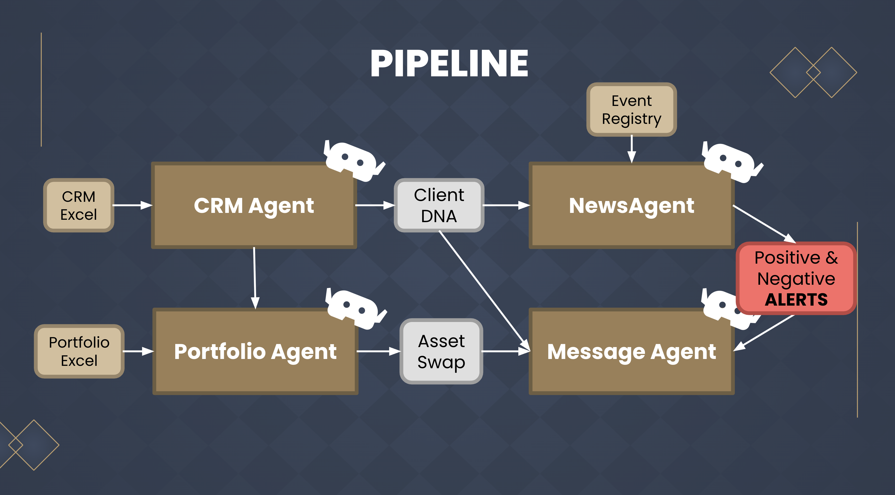

<p align="center">
  
</p>

<h1 align="center">Customer DNA Advisor</h1>

<p align="center">
  <strong>AI copilot for private banking relationship managers</strong><br />
  Built for the <strong>SIX challenge</strong> at <strong>SwissHacks 2026</strong> · Zürich, Switzerland<br />
  <em>Powered by <strong>HispanIA</strong></em>
</p>

<p align="center">
  
  
  
  
</p>

---

## The problem

Relationship managers at private banks juggle CRM notes, portfolio mandates, live market news, and client values — often under time pressure when a headline threatens a held position. **Customer DNA Advisor** turns that fragmented workflow into a single, review-first pipeline: detect conflicts, score replacements against client DNA, and draft a message the RM can approve before anything reaches the client.

## What we built

A **multi-agent intelligence system** that helps RMs react to portfolio-relevant news with context, conviction, and compliance in mind.

| Agent | Role |
| --- | --- |
| **CRM Agent** | Extracts client “DNA” — values, red lines, communication style — from CRM data and OSINT signals |
| **News Agent** | Monitors news streams and flags events that conflict with client beliefs or holdings |
| **Portfolio Agent** | Finds same-sector swap candidates, scores them against DNA, and pulls live pricing via **SIX** |
| **Message Orchestrator** | Combines agent outputs into validated, RM-ready draft messages — never auto-sends |

Everything flows into a **Wealth Advisory Dashboard**: one screen where Sarah Meier (demo RM) selects a client, runs the pipeline, reviews conflicts, swap proposals, and message drafts.



## Key features

- **Deterministic collision detection** — news must match both CRM values *and* a held security (ISIN or issuer); the LLM is not trusted with portfolio math
- **DNA-aligned swap scoring** — replacements below the alignment threshold are rejected; alert-only drafts still reach the RM
- **Human-in-the-loop by design** — drafts are for review; no trades or messages are executed automatically
- **SIX integration** — live asset pricing and market data through the SIX MCP API
- **OSINT enrichment** — optional lifestyle signals from public profiles to personalise rapport
- **Multi-client demo** — Schneider, Räber, Huber, and Ammann sample portfolios from the hackathon dataset

## Quick start

### 1. Clone & install

```bash
git clone https://github.com/your-org/SwissHacks-HispanIA.git
cd SwissHacks-HispanIA

python3.11 -m venv .venv
source .venv/bin/activate   # Windows: .venv\Scripts\Activate.ps1
pip install -r requirements.txt
```

### 2. Configure environment

Create a `.env` file in the project root:

```env
# LLM (Phoeniqs)
PHOENIQS_API_KEY=your_key
PHOENIQS_API_URL=https://maas.phoeniqs.com/v1
PHOENIQS_MODEL=inference-gpt-oss-120b

# News
NEWSAPI_KEY=your_key
NEWSAI_API_URL=https://eventregistry.org/api/v1

# SIX MCP
SIX_MCP_URL=https://ca-mcpwebapi-tools.nicepebble-599ed11f.westeurope.azurecontainerapps.io/mcp
SIX_MCP_TOKEN=your_token

# Optional — OSINT via Proxycurl
PROXYCURL_API_KEY=your_key
```

### 3. Run the dashboard

```bash
cd demo
python app.py
```

Open **http://localhost:8000** — pick a client and hit **Run Agent Intelligence Pipeline**.

### 4. Run the integration pipeline (CLI)

From the repository root:

```bash
python -m demo.backend.integration \
  --client-id schneider \
  --client-name "Hubertus Schneider" \
  --crm-excel "data/SwissHacks CRM.xlsx" \
  --portfolio-excel "data/SwissHacks Portfolio Construction.xlsx" \
  --portfolio-sheet "Sample Portfolio Balanced" \
  --run-id "demo-001"
```

For a guaranteed collision demo, pass `--news-json demo/backend/integration/examples/roche_collision_news.json`.

## Project structure

```
SwissHacks-HispanIA/
├── data/                          # Hackathon CRM & portfolio workbooks
├── demo/
│   ├── app.py                     # FastAPI server + dashboard API
│   ├── static/dashboard.html      # RM dashboard UI
│   └── backend/
│       ├── agents/                # CRM, News, Portfolio, SIX client, OSINT
│       ├── integration/           # Agent pipeline + collision detector
│       └── orchestrator/          # Message draft generation
├── tests/
└── requirements.txt
```

## Team HispanIA

**Customer DNA Advisor** was built by team **HispanIA** at SwissHacks 2026.

| | |
| --- | --- |
| **Carlota Criado** | |
| **Xavier Sánchez** | |
| **Amritpal Singh** | |
| **Nicolás Damián** | |
| **Eric López** | |

---

<p align="center">
  <sub>Customer DNA Advisor · Powered by HispanIA · SwissHacks 2026 · SIX Challenge · Zürich</sub>
</p>
